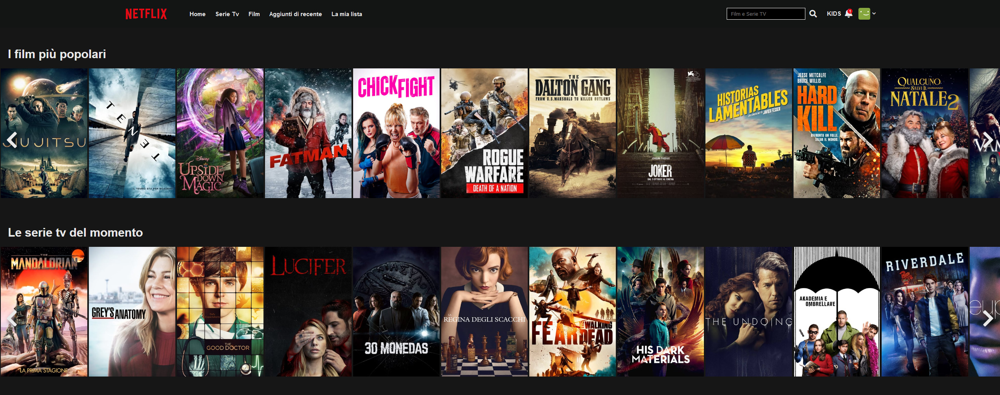
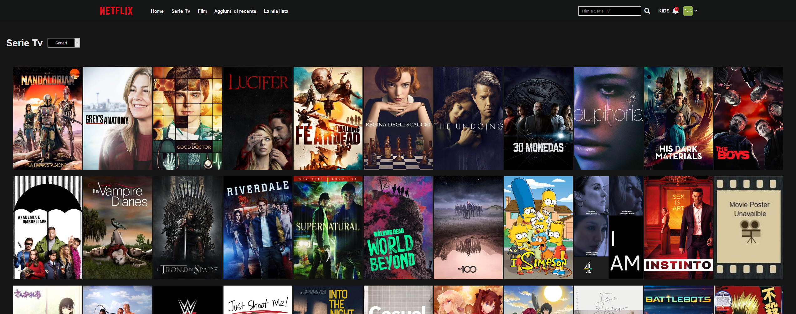
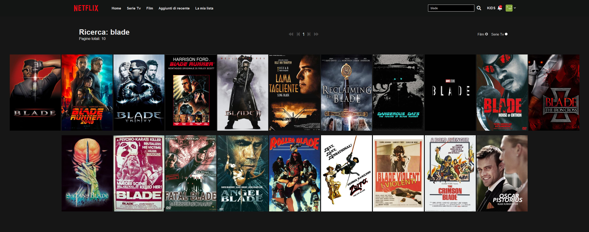

<h1> Boolflix </h1>
<h4> A Netflix Web App clone </h4>

 Powered by Boolean Careers and developed with: 

<ul>
	<li>Html</li>
	<li>CSS</li>
	<li>JavaScript</li>
	<li>Vue</li>
	<li>Axios</li>
	<li>The Movie Database (TMDb) API</li>
</ul>

<h4> Homepage </h4>

<h4> Movies and Tv Shows </h4>

<h4> Search results </h4>

<h4> GIFs </h4>

